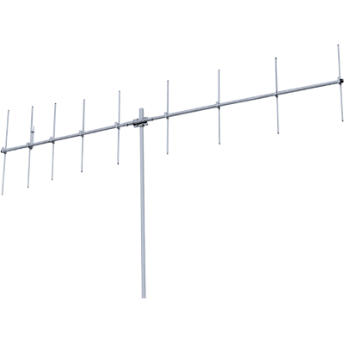
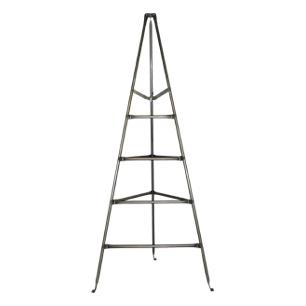
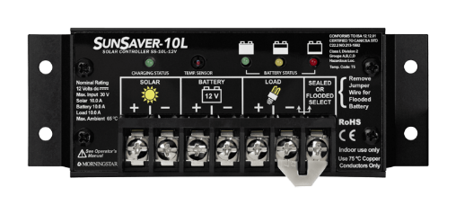
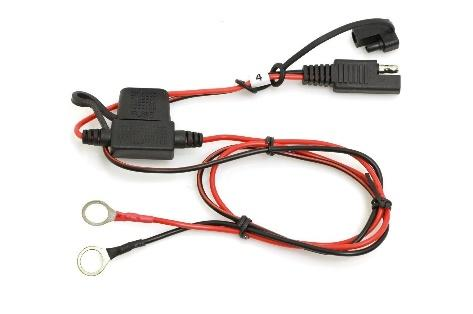
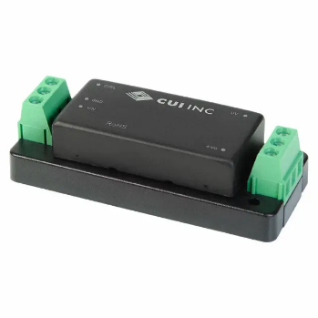
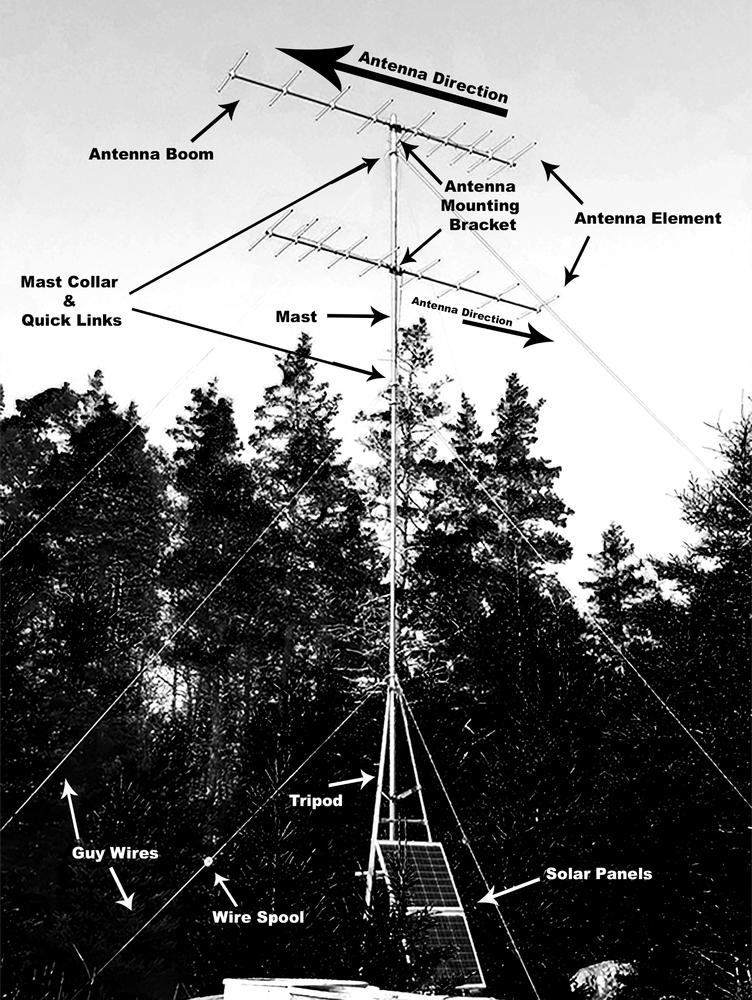
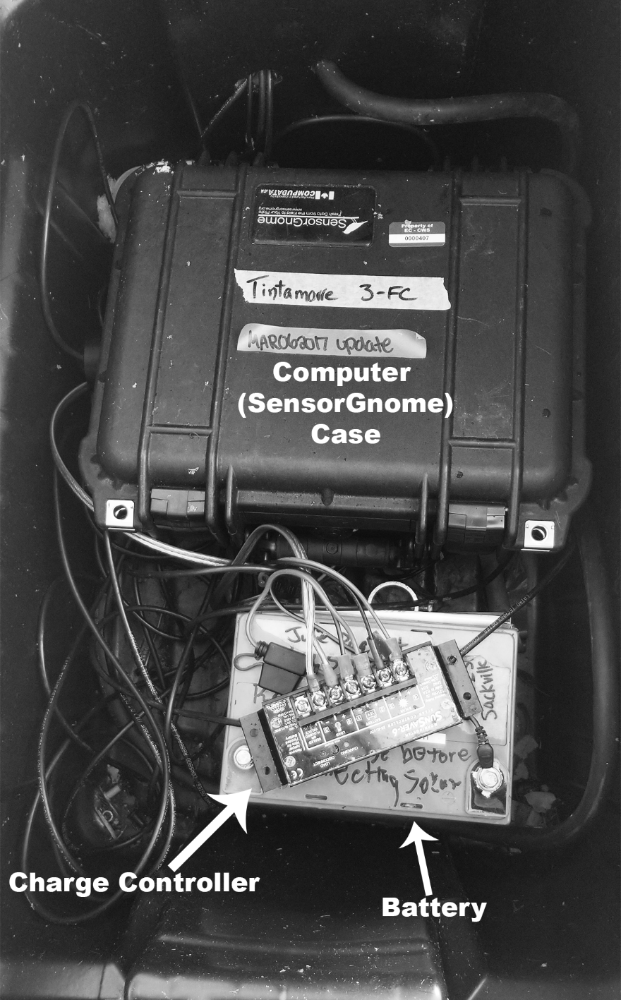
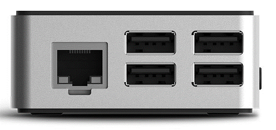
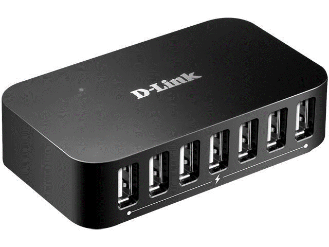
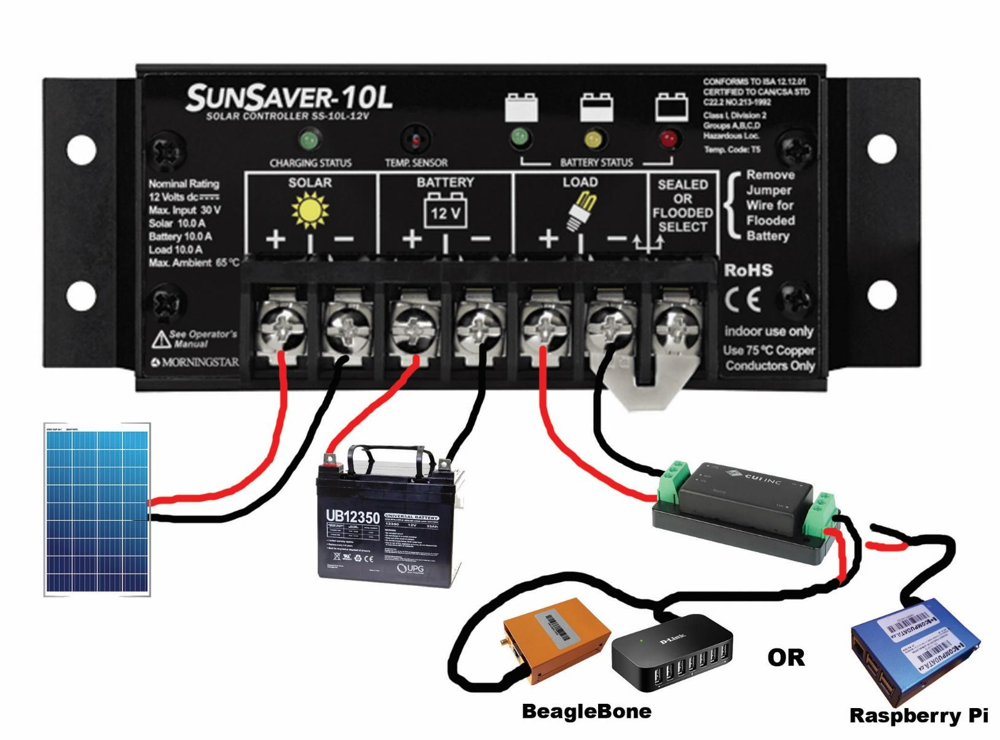

# Appendix D: Parts description

**Parts description and what to look for \(see diagrams on last three pages\)**

<table>
  <thead>
    <tr>
      <th style="text-align:left"><b>Antennas</b> 
        
      </th>
      <th style="text-align:left">
        
<b>Description</b>
        

        
Attached to the top of the mast. The antenna boom attaches to the mast
          with an antenna mounting bracket, and the antenna elements attach to the
          boom. There are usually 9 elements attached to the boom with one element
          that has a coaxial cable coming out of it.

        
<b>What to look for:</b>
        

        <ul>
          <li>Bent elements will affect the signal reception, but usually not that badly
            unless severely bent (~30 degrees). The most important element is the one
            that has the coaxial cable. Just take photos of anything bent.</li>
          <li>Loose elements. If they are not all horizontally aligned, they might be
            loose. Try tightening to bolts.</li>
          <li>If the antenna directions are wrong, the boom might not be attached to
            the mast tight enough. Try rotating the antenna by hand and if it&#x2019;s
            easy, tighten the u-bolts on the antenna mounting bracket. Add bicycle
            inner tubes if necessary.</li>
        </ul>
      </th>
    </tr>
  </thead>
  <tbody>
    <tr>
      <td style="text-align:left">
        
<b>Tripod</b>
        

        

          
        

      </td>
      <td style="text-align:left">
        
<b>Description:</b>
        

        
The three-legged support that the mast slides into &#x2013; about 10 feet
          tall. Solar panels are usually mounted here.

        
<b>What to look for:</b>
        

        <ul>
          <li>Is the tripod level?</li>
          <li>Is the tripod easy to rock back and forth?</li>
          <li>Have any of the legs sunk into the ground?</li>
        </ul>
      </td>
    </tr>
    <tr>
      <td style="text-align:left">
        
<b>Mast</b>
        

        

          
        

      </td>
      <td style="text-align:left">
        
<b>Description</b>
        

        
The tall metal pole at the center of the tower where the antennas are
          mounted. It has 3-4 telescopic sections that can be fixed in place by L-bolts.

        
<b>What to look for</b>:

        <ul>
          <li>Is it bent?</li>
          <li>Does it rotate freely?</li>
          <li>Is it being supported by 3 guy wires for every 10&#x2019; of height?</li>
        </ul>
      </td>
    </tr>
    <tr>
      <td style="text-align:left">
        
<b>Guy wires and spools</b>
        

        

          
        

      </td>
      <td style="text-align:left">
        
<b>Description</b>
        

        
The metal cables that support the mast at every 10&#x2019; section. They
          are attached to the mast collar with quick links. They are tightened by
          wire spools.

        
<b>What to look for:</b>
        

        <ul>
          <li>Are there 3 guy wires for every 10&#x2019; section of mast height?</li>
          <li>Are all guy wires tight?</li>
          <li>Are there spools missing from the loose guy wires?</li>
        </ul>
      </td>
    </tr>
    <tr>
      <td style="text-align:left">
        
<b>Coaxial cable</b>
        

        

          
        

      </td>
      <td style="text-align:left">
        
<b>Description</b>
        

        
This is what plugs into the antennas and connects to the computer.

        
<b>What to look for:</b>
        

        <ul>
          <li>Is it firmly connected on both ends?</li>
          <li>Are there any cracks or have animals chewed up the cable? If any of the
            inner metal wiring is exposed you must replace it.</li>
        </ul>
      </td>
    </tr>
    <tr>
      <td style="text-align:left">
        
<b>Mast collar &amp; quick links</b>
        

        

          
          
        

        
<em>Mast Collar Quick Link</em>
        

      </td>
      <td style="text-align:left">
        
<b>Description</b>
        

        
Mast collar is a ring that goes around the mast and has hole which holds
          the quick links. Quick links are attached to the guy wires.

        
<b>What to look for:</b>
        

        <ul>
          <li>Are the quick links all closed properly?</li>
          <li>Are their guy wires attached to each of them?</li>
          <li>Is the guy wire fraying where they are attached?</li>
        </ul>
      </td>
    </tr>
    <tr>
      <td style="text-align:left"><b>Solar panel</b>
      </td>
      <td style="text-align:left">
        
<b>Description</b>
        

        
Attached to the tripod by angle iron. It has wires attached to the back
          of the panel that lead into the action packer and plug into the solar charge
          controller.

        
<b>What to look for:</b>
        

        <ul>
          <li>Is the panel attached firmly to the tripod?</li>
          <li>Are there any cracks or chews in the cables?</li>
          <li>What is the voltage of the solar panel (check on charge controller terminals)?</li>
          <li>Is the panel angled correctly? About 30 degrees.</li>
          <li>Is the angle iron scratching into the back of the panel?</li>
        </ul>
      </td>
    </tr>
    <tr>
      <td style="text-align:left"><b>Charge controller</b> 
        
      </td>
      <td style="text-align:left">
        
<b>Description</b>
        

        
Inside the action packer, this is the device that controls the power from
          the solar panel to the battery and from the battery to the computer. There
          should be six terminals on here, two for each of the solar panel, battery,
          and computer (computer terminals are labeled as &#x2018;load&#x2019;).

        
<em><b>Be very careful not to short circuit any of the two terminals!!</b></em>
        

        
<b>What to look for:</b>
        

        <ul>
          <li>What color are the battery status LEDs? There should be red, yellow, or
            green. If more than one are lit, describe the pattern and replace the charge
            controller. If the LED is red, your battery might be dead.</li>
          <li>What color is the charging status LED?</li>
          <li>Are the connections tight?</li>
          <li>Is there any sign of corrosion or rust?</li>
          <li>Check the polarity of all cables: are the positive ends connected to the
            positive terminals?</li>
        </ul>
      </td>
    </tr>
    <tr>
      <td style="text-align:left">
        
<b>Battery</b>
        

        

          
        

        
<em>Fused battery leads</em>
        

      </td>
      <td style="text-align:left">
        
<b>Description</b>
        

        
Inside the action packer. Plugs directly into the charge controller. Sometimes
          there is a fuse attached to the positive cable.

        
<b>What to look for:</b>
        

        <ul>
          <li>What is the battery voltage? Anything below 11 volts or above 15 volts
            is bad.</li>
          <li>Are there any signs of corrosion or rust?</li>
          <li>Are the connections tight?</li>
          <li>If there is a fuse and battery status light on the charge controller is
            red, is the fuse blown?</li>
        </ul>
      </td>
    </tr>
    <tr>
      <td style="text-align:left">
        
<b>Action packer</b>
        

        

          
        

      </td>
      <td style="text-align:left">
        
<b>Description</b>
        

        
The large plastic case that holds the computer (in pelican case) and battery.

        
<b>What to look for:</b>
        

        <ul>
          <li>Is the lid on properly? Did the last person to visit close it correctly?</li>
          <li>Has water collected in the box?</li>
          <li>Is the elbow pipe where the cables go into the box pointing upwards? It
            should point downwards so water doesn&#x2019;t get in.</li>
          <li>Are there holes in the bottom of the box? There should be small holes
            to allow moisture to get out.</li>
          <li>Is the box raised off the ground? It should be so water can drip out of
            the holes.</li>
          <li>Is the box sitting in a wet, low-lying area? If yes, consider raising
            it a foot or two.</li>
        </ul>
      </td>
    </tr>
    <tr>
      <td style="text-align:left">
        
<b>Computer</b>
        

        

          
        

        
<em>BeagleBone</em>
        

        

          
        

        
<em>Raspberry Pi</em>
        

      </td>
      <td style="text-align:left">
        
<b>Description</b>
        

        
Inside the pelican case, it is a small metal box that&#x2019;s about 3&#x201D;x4&#x201D;x2&#x201D;
          and is usually orange or blue. There is usually a red or blue LED blinking
          and a serial number written on the top. There are two types: Raspberry
          Pi and BeagleBone. Raspberry Pi has 4 USB ports on one end. Beagle Bone
          has just one USB port.

        
<b>What to look for</b>:

        <ul>
          <li>What is the serial number? Write it down at the top of the checklist.</li>
          <li>Are there LED&#x2019;s on or blinking? Take a video and/or describe their
            colour and behaviour.</li>
        </ul>
      </td>
    </tr>
    <tr>
      <td style="text-align:left">
        
<b>DC-DC Voltage Converter</b>
        

        

          
        

      </td>
      <td style="text-align:left">
        
<b>Description</b>
        

        
This lowers the battery voltage down to something the computer can handle
          (5 volts). On one end it has wires that connect directly to the charge
          controller load terminals and the other end has a barrel jack or micro
          USB cord (depend on computer type) that plugs into the computer.

        
<b>What to look for:</b>
        

        <ul>
          <li><b>ONLY NEEDED FOR SOLAR + BATTERY INSTALLATIONS</b>
          </li>
          <li>Is the green LED lit up?</li>
          <li>Are the wires securely in place?</li>
          <li>If LED is off and wires are secure, check voltage of wires and make sure
            they are connected to the correct terminals.</li>
        </ul>
      </td>
    </tr>
    <tr>
      <td style="text-align:left">
        
<b>USB Hub</b>
        

        

          
        

      </td>
      <td style="text-align:left">
        
<b>Description</b>
        

        
This is only present in BeagleBone computers (you might not have any).
          They are black with rounded corners and have a green or blue LED that lights
          up when powered on. It has 7 USB ports on it and some of them have the
          coaxial cables plugged into them.

        
<b>What to look for:</b>
        

        <ul>
          <li>ONLY NEEDED FOR BEAGLEBONE COMPUTERS</li>
          <li>Is the USB hub powered on?</li>
          <li>Are all the connections tight?</li>
        </ul>
      </td>
    </tr>
    <tr>
      <td style="text-align:left">
        
<b>GPS</b>
        

        

          
        

      </td>
      <td style="text-align:left">
        
<b>Description</b>
        

        
This is what plugs into the computer with a small SMA adapter (screws
          in). It&#x2019;s a small black square (~1.5&#x201D;) with a long thin cable
          attached.

        
<b>What to look for:</b>
        

        <ul>
          <li>Is it plugged in to the computer?</li>
          <li>Does it have any cracks or tears in the cable?</li>
        </ul>
      </td>
    </tr>
  </tbody>
</table>

**Inside Action Packer**

**Inside Computer Case with Raspberry Pi \(No USB Hub needed\)**

**Inside Computer Case with BeagleBone \(USB Hub Present\)**

**USB Port Numbering for Raspberry Pi or BeagleBone computers.**

Note BeagleBone computers only has 1 USB port so it must use a USB Hub to expand the number of available ports. Raspberry Pi computers have 4 ports so they _do not_ require a USB hub.

| **Raspberry Pi** | **USB Hub \(for BeagleBone\)** |
| :--- | :--- |
|  |  |

**Charge Controller Wiring**

