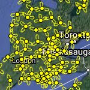
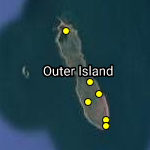

# Station Placement

Not all stations are created equal. Some will primarily achieve local objectives, others are part of regional networks, and others strategically placed at migration, or movement hotspots serve the collective needs of the entire network. At the end of the day, all stations work together to make up the Motus network and provide data to far more projects than your own. Motus is the ultimate, hands-on, community science project.

## Site Selection

Before deploying any stations, you need to know what the primary purpose of the station is. What works best for your region based on migratory flyways, topography and local infrastructure available, foraging locations, your goals, funding, the location of nearby stations.

Ideally, adjacent stations will complement one another; that is, they operate on similar frequencies and have antennas which point towards one another to provide detections of tagged animals as they pass between the stations. Multiple receivers can be employed to build a receiver ‘fence’ to detect any animals that may pass over a geographic area. Examples of these can be seen in the North-eastern US and along the North Sea of Europe. In Ontario, where many more stations are available, there is a grid of stations \(or series of fences\) to allow for better spatial resolution of movements. On study sites like Sable Island and Bon Portage Islands in Nova Scotia very small grids have been used to study local movements.

| [  Receiver Fence   \(Panama Canal\)](https://motus.org/wp-content/uploads/2020/02/receiver_fence_Panama.png) | [  Receiver Grid   \(Ontario\)](https://motus.org/wp-content/uploads/2020/02/receiver_grid_Ontario.png) | [   Local Array   \(Bon Portage Island\)](https://motus.org/wp-content/uploads/2020/02/receiver_local_BonPortage.png) |
| :---: | :---: | :---: |

When selecting a site, it’s important to consider how the landscape features will affect the range of your antennas. Generally, higher stations have a greater range and detection probability of passing animals, but have a more limited probability of detecting local movements \(depending on the type of antenna that is attached\). In most instances, stations should be placed in the highest elevation possible within the area of interest, ensuring there is a clear line of sight in each direction you wish to point the antennas. It’s also important to ensure there aren’t any obstructions immediately behind the antennas \(within a few meters\), especially metal surfaces like roofing.

CTT Nodes work in a similar fashion to other Motus stations, but at a much smaller scale. These devices are best suited for fine-scale studies. Read more about CTT Nodes here: [**CTT Nodes**](https://celltracktech.com/products/tag-system/ctt-node/)\*\*\*\*

## Antenna Interference

Antennas can receive interference if placed too close to metal objects or other antennas, or sources of electromagnetic noise \(even air conditioners, generators, lawn mowers\). Depending on frequency and location, radio interference from third-party broadcasters and cellular can also be problematic. Some online tools exist to locate licensed radio broadcasters by location \([click here for Canadian stations](https://tafl.jonathanmorgan.net/)\).

### Testing for antenna interference

One can conduct tests at a site prior to station setup, but none have been well tested. Below are some guidelines which may help identify noisy sites.

#### Measuring the noise floor

1. [Download SDR Console from their website](https://www.sdr-radio.com/download)
2. Plug the FUNcube dongle into your computer and run the SDR Console software.
3. Select the FUNcube dongle from the list of devices and tune it to the desired frequency.
4. Plug in an antenna and take measurements in all directions at or near the height where the antennas will be when the station is installed.
5. If you measure anything above **XX dB,** there may be a problematic noise source in that direction.

#### Measuring with a Motus receiver

1. Power on your receiver and plug in an antenna.
2. Point the antenna all direction at or near the height where the antennas will be when the station is installed, moving in a circle over a 5-minute period.
3. Download the data you just collected from your Motus receiver.
4. Open R and run the script provided here: **\[ LINK TO A SCRIPT \]**
5. If you're given a probability of less than 5%, you're good to go!


Use your receivers web interface to record the time you begin and end your measurements to get a more precise \(and accurate\) time.



It's best to use the exact same receiver you intend to be installing at that site.


### Antenna Spacing

Yagi antennas should be vertically spaced according to their direction and frequency. Make sure you have ample spacing between your antennas and any sheet metal, such as roofing. The typical figure for minimum spacing and metal roofing is 1 full wavelength. Yagi antennas that point in the opposite direction \(parallel\) will interfere with each other if spaced too close together, essentially eliminating the directionality and severely impacting the detection range. Antennas that are parallel \(180 degrees\) should be at least ½, but best at a whole wavelength apart. Antennas that are perpendicular \(90 degrees\) should be at least ¼ wavelength apart.

| **Antenna Type** | **Tags** | **Frequency** | **Wavelength** |
| :--- | :--- | :--- | :--- |
| 9-element Yagi | Lotek | 166.380 MHz | 1.80 meters |
| 9-element Yagi | Lotek | 151.500 MHz | 1.98 meters |
| 9-element Yagi | Lotek | 150.100 MHz | 2.00 meters |
| 9-element Yagi | CTT | 434 MHz | 0.69 meters |

## Antenna Mounting Structure

Motus stations have been built on just about anything – lighthouses, towers, trees, cars, drones, planes, ships, buoys, bamboo masts, and just about every type of building you can dream of. [Click here for a list of example stations](https://motus.org/selection-guide/station-examples).

The actual structure doesn’t necessarily matter as long as it’s strong and elevated enough to provide a clear line-of-sight, and the antennas are not mounted close to sheet metal or other antennas \(see [Antenna Interference](station-placement.md#antenna-interference) above\). The easiest and often the cheapest method is o use a pre-existing building or structure upon which masts or antenna can be affixed to existing railings, or on the side of buildings where a DMX-style structure\(link\) can be mounted. Installation can be tricky, and every situation is different, but once it’s set up there shouldn’t be much maintenance or worry.

In remote locations where there aren’t any buildings to attach towers, one can use a tripod and mast like those manufactured by [Wade Antenna](http://wadeantenna.com/), or other guyed or un-guyed self-standing tower design \(link or picture\). Pop-up towers must be guyed \(3 lines per 10-foot section\) and anchored \(1 anchor per guy or just 3 strong anchors\). These structures are more sensitive to wind and ice than the DMX-style structures so regular maintenance will be necessary.

We can’t stress enough the importance of excess supports in any setup situation. Use more and stronger guy wires than you think you need, more waterproofing, more wall mounts, bigger batteries, bigger solar panels, and strong gauge, galvanized or stainless steel materials \(especially in marine environments\). It will cost you more in the end per setup, but shortcuts will often cost you more in the long-term.

The following list includes equipment commonly used across North America. For equipment used in other regions, please [contact us](mailto:motus@birdscanada.org).

* Against the wall of a building: [DMX tower \(36′\)](http://wadeantenna.com/product/36-foot-dmx-bracketed-tower/)
* Pre-existing towers
  * Cell towers
  * Radio towers
* Free-standing
* Roof Mounts
* Non-penetrating Roof Mounts
* Wall Mounts
* Non-penetrating roof mount:
  * Stand: [NPRM-2](http://wadeantenna.com/product/heavy-duty-non-penetrating-roof-mount/)
  * [Masting](http://wadeantenna.com/product/masting/)
* Free-standing:
  * Tripod: [TRM-10L](http://wadeantenna.com/product/10-foot-tripod/)
  * Telescopic Mast \(40-foot\): [40A](http://wadeantenna.com/product/1499/)
  * Also requires: guy lines and anchors when mounting multiple antennas

With all these mounting methods in mind, we recommend you contact your local supplier for [Wade Antenna](http://wadeantenna.com/) to find the best solution for your location.

